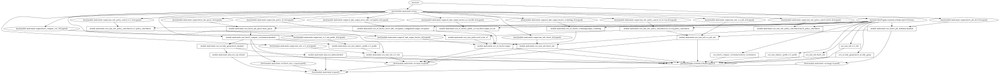

# AWS Batch Snakemake Pipeline with Terraform

## Sources
Based on the [Automate Terraform with GitHub Actions tutorial](https://developer.hashicorp.com/terraform/tutorials/automation/github-actions).

Adopted Batch workflow from:
* https://medium.com/swlh/terraform-aws-batch-and-aws-efs-8682c112d742
* Opted for no EFS.
    * Could be useful for reading one shared resource multiple times across runs.
    * Faster to attach fs instead of downloading file.

Best Practices:
* https://cloud.google.com/docs/terraform/best-practices-for-terraform

Pre-commit:
* https://jamescook.dev/pre-commit-for-terraform
